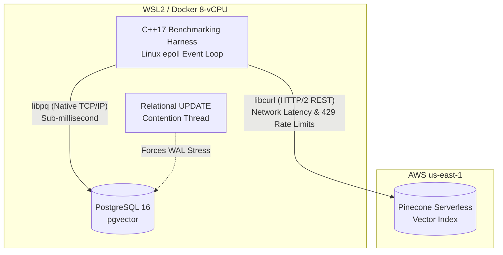

# CMP653: Vector Database Benchmarking Harness
**Comparing PostgreSQL (pgvector) vs. Pinecone (Serverless) under Hardware Constraints**

This repository contains the natively compiled C++17 benchmarking harness developed for the CMP653 course. It evaluates the architectural bottlenecks of executing "Hybrid Queries" on local shared-memory databases versus decoupled cloud-native vector engines.

## System Architecture



## Prerequisites

To ensure absolute reproducibility, the host environment requires:

* Ubuntu 24.04 (WSL2 or Native)
* C++17 Compiler (GCC) and CMake
* Required Libraries: `libpqxx-dev`, `libcurl4-openssl-dev`
* `nlohmann/json` (Header-only, already included in `/src`)

## Build and Run Instructions

**1. Clone the repository:**
```bash
git clone https://github.com/obalcikli/cmp653-benchmark.git
cd cmp653-benchmark/src
```

**2. Compile the Harness:**
```bash
rm -rf CMakeCache.txt CMakeFiles/
cmake .
make
```

**3. Execute the Benchmark:**
```bash
./benchmark_harness
```